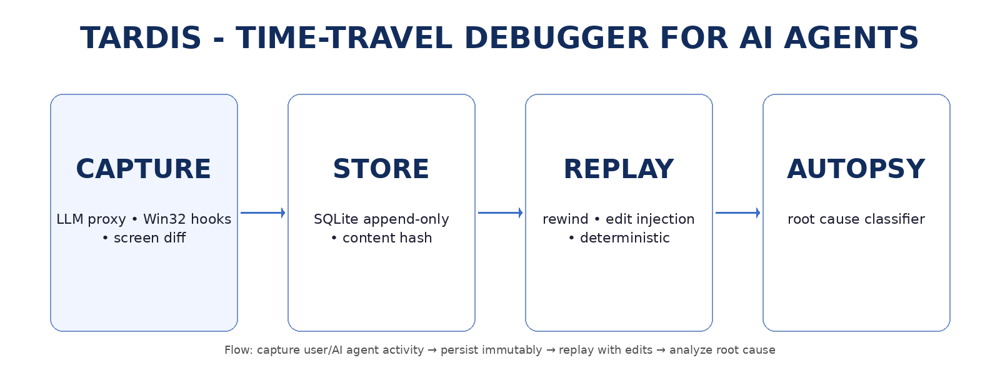

# TARDIS — Time-Travel Debugger for AI Agents

**Deterministic flight recorder, replay engine, and root-cause autopsy for computer-use agents.**

```bash
pip install tardis-agent-debug
tardis wrap  # one-line wrap of OpenAI / Anthropic client
# run your agent — every LLM call, tool invocation, and screen frame is captured
tardis replay <trace> --from 20   # rewind to step 20, replay forward
tardis autopsy <trace>            # what broke? why?
```

---

## Why TARDIS

Computer-use agents fail — often at step 147 of 150. Standard observability logs text. TARDIS logs **causality**:

- Every LLM prompt, completion, token count, and cost
- Every tool call, result, and error with duration
- Every screen frame, pixel diff, and layout shift
- Content-addressed hashing for byte-for-byte deterministic replay
- Automatic failure classification with evidence and fix suggestions

---

## How It Works



**Capture** → **Store** → **Replay** → **Autopsy**

1. **Capture** — Proxy wrappers intercept OpenAI and Anthropic calls, tool invocations, and screen frames via Win32 hooks with zero code changes to your agent logic.
2. **Store** — Every step is recorded in an append-only SQLite store with content-addressed hashing. Traces are immutable and time-indexed.
3. **Replay** — Deterministic engine rewinds to any step, injects edited tool outputs to explore what-if scenarios, and replays forward with breakpoint support.
4. **Autopsy** — A multi-pattern classifier scores confidence across 8 failure detection methods, collects supporting evidence, and generates specific fix suggestions.

---

## Install

```bash
git clone <repo>
cd tardis
pip install -e ".[dev]"
tardis health
```

### Dependencies

| Dependency | Purpose |
|---|---|
| `pydantic>=2.5` | Data models (Trace, Step, FailureType) |
| `click>=8.1` | CLI framework |
| `rich>=13.0` | Terminal formatting |
| `mss>=9.0` | Cross-platform screen capture |
| `Pillow>=10.0` | Image diff, hashing, analysis |
| `openai>=1.0` | OpenAI API proxy |
| `lancedb>=0.6` | Vector store for failure patterns |

---

## Quickstart

```python
import tardis
from openai import OpenAI

rec = tardis.Recorder().start()
client = tardis.wrap(OpenAI())

# your agent loop — unchanged
response = client.chat.completions.create(
    model="gpt-4o",
    messages=[{"role": "user", "content": "fix the EBUSY error"}],
)

trace = rec.stop()
# tardis replay <id> --from 5
# tardis autopsy <id>
```

For Anthropic:

```python
from anthropic import Anthropic
client = tardis.wrap_anthropic(Anthropic())
```

---

## CLI Reference

```
tardis init                                          Create .tardis/ storage directory
tardis health                                        Check database status
tardis list                                          List traces with success/cost/tokens
tardis show <id>                                     Render causal graph
tardis show <id> --export-dot graph.dot              Export causal graph as DOT
tardis replay <id> [--from N] [--to N]               Deterministic replay
tardis replay <id> --edit-tool-output '{"code": 0}'  Inject edited tool output
tardis autopsy <id>                                  Root-cause classification report
tardis analyze <id>                                  Pattern analysis (LLM, errors, tools)
tardis export <id> --format json                     Export trace as JSON
tardis export <id> --format negative-pair            Export contrastive pair for RL
```

---

## Core Concepts

### Traces & Steps

A `Trace` is an ordered sequence of `Step` objects. Each step captures a single event:

| Step Type | Description |
|---|---|
| `llm_call` | LLM prompt + completion with token/cost metadata |
| `tool_call` | Tool invocation with input/output |
| `tool_result` | Tool execution result |
| `screen_frame` | Screen capture at a point in time |
| `user_action` | User intervention |
| `thought` | Agent internal reasoning |
| `error` | Captured exception with context |

Every step carries a content-addressed hash for change detection and replay integrity.

### Failure Classification

The autopsy classifier checks 8 failure modes and returns the highest-confidence match:

| Failure Type | Detection Method |
|---|---|
| `reasoning_failure` | Hash repetition detection, pattern similarity |
| `grounding_failure` | UI element interaction errors, screen diff analysis |
| `tool_failure` | Repeated error hash chains, timeout detection |
| `memory_failure` | Context-length exceeded, long conversation heuristics |
| `environment_drift` | Auth errors, rate limits, network failures, resource exhaustion |
| `unknown` | Fallback with trace summary |

### Causal Graph

Edges encode semantic relationships between steps:

- `tool_informs_llm` — tool results influence subsequent LLM reasoning
- `llm_calls_tool` — LLM decisions trigger tool invocations
- `causes_error` / `error_propagation` — failure chains
- `context_chain` — sequential LLM context windows
- `temporal` — sequential ordering (baseline)

The graph supports critical-path analysis (trace failure chains backward), loop detection (DFS-based cycle finding), and DOT export for GraphViz visualization.

### Replay Engine

- Rewind to any step index with `--from` / `--to`
- Inject edited tool outputs to test hypothetical fixes
- Breakpoints with interactive inspect (`i`), continue, quit
- Pattern analysis across LLM calls, error types, and tool usage
- Cross-trace diff to find divergences between runs

---

## Project Structure

```
src/tardis/
  __init__.py          # Package exports: Recorder, record, wrap, wrap_anthropic
  models.py            # Pydantic models: Trace, Step, StepType, FailureType
  config.py            # TOML-based configuration loader
  cli.py               # Click CLI with 8 commands

  capture/
    recorder.py        # Flight recorder: start/stop/log with thread-local context
    llm_proxy.py       # OpenAI client wrapper with token/cost tracking
    anthropic_proxy.py # Anthropic client wrapper with token/cost tracking
    tool_wrapper.py    # Decorator for instrumenting tool calls
    screen.py          # Screen capture (mss), pixel diff, layout shift detection

  store/
    sqlite_store.py    # Append-only SQLite with prefix ID matching

  replay/
    engine.py          # Deterministic replay with breakpoints, inspect, diff, analysis

  causal/
    graph.py           # Multi-relationship causal graph with critical path & loop detection

  autopsy/
    classifier.py      # 8-method failure classifier with confidence scoring & evidence

  utils/
    hashing.py         # Content-addressed SHA-256 hashing
    platform.py        # Cross-platform: Windows/macOS/Linux detection, screen, window, fs

examples/
  basic_agent.py               # Minimal OpenAI recording example
  anthropic_agent.py           # Anthropic client usage
  tool_tracing_example.py      # Tool call tracing with error handling
  replay_example.py            # Replay + causal graph demonstration
  advanced_analysis_example.py # Full analysis workflow (patterns, graph, autopsy)

tests/
  test_models.py               # Model validation, aggregation, error tracking
  test_causal_graph.py         # Graph construction, critical path, loops, DOT export
  test_autopsy.py              # Classifier accuracy, evidence, fix suggestions, reports
```

---

## Roadmap

- **v0.1** — OpenAI + Anthropic wrappers, SQLite store, deterministic replay, heuristic autopsy, screen diff, causal graph analysis *(current)*
- **v0.2** — DOM/accessibility snapshots, advanced grounding analysis, ML-assisted classification
- **v0.3** — Cross-platform window management, distributed trace aggregation
- **v1.0** — eBPF integration, multi-agent orchestration, real-time monitoring dashboards

---

## License

MIT
